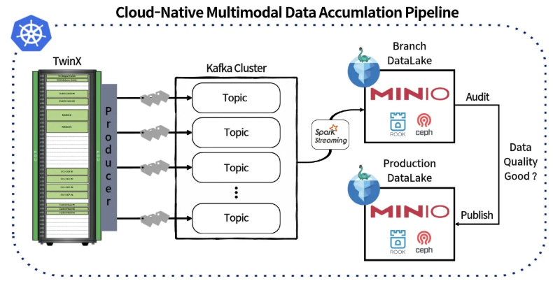

# Cloud-Native Multimodal Data Accumulation Pipeline

---

## 개요

이 프로젝트는 **Cloud-Native 환경에서 멀티모달 대용량 데이터를 실시간으로 수집, 분류, 품질 검증, 최적화하여 데이터레이크/레이크하우스에 축적**하는 파이프라인의 설계와 구현 사례를 다룹니다.

- **실시간성, 품질 보장, 메타데이터 중심 설계**  
  단순 적재가 아닌, 수집 단계 메타데이터와 WAP(Write-Audit-Publish) 패턴을 통한 고품질 데이터 축적이 핵심입니다.

---

## 파이프라인 구조 및 특징

### 1. 실시간 멀티모달 데이터 수집

- **Kafka Producer**  
  IoT, 센서, 로그, 이미지, 텍스트 등 다양한 소스의 데이터를 실시간 ingest
- **Topic별 분류**  
  데이터 특성에 따라 Kafka Topic을 분리, 각 Topic별로 테이블 관리

### 2. 메타데이터 중심 축적

- **수집 레벨 메타데이터**  
  Ingestion Timestamp, Source ID, 상태 등 수집 시점의 메타데이터를 함께 저장  
  (카탈로그 수준이 아닌, 수집·적재 단계의 메타데이터)
- **데이터 품질 관리**  
  Kafka → Data Lake 적재 시 WAP 패턴 적용  
  Nessie Multi Table Branch에서 데이터 검증 후, 통과 데이터만 메인 브랜치로 Merge

### 3. 대용량/멀티모달 데이터 지원

- **Iceberg 테이블 관리**  
  타임시리즈, 이미지, 텍스트 등 다양한 데이터 타입을 Iceberg 테이블로 관리  
  스키마 진화, 동적 스키마 지원

### 4. 최적화 및 유지관리

- **Compaction & Orphan File Clean-up**  
  파일 병합, Snapshot/Manifest 최적화, 고아 파일 정리 자동화  
  운영 효율성 및 스토리지 최적화

---

## 전체 아키텍처 흐름

1. **데이터 소스**  
   - IoT, 센서, 로그, 이미지, 텍스트 등 -> 타임시리즈 데이터
2. **Kafka Producer (TwinX)**  
   - 데이터 특성별 Topic 분리, 수집 레벨 메타데이터 태깅
3. **Kafka Cluster**  
   - Topic별 스트림 관리
4. **Spark Streaming + Nessie Catalog**  
   - 데이터 검증, WAP(Write-Audit-Publish), Multi Table Branch 관리, Merge
5. **MinIO DataLake (Iceberg Table)**  
   - 실제 데이터 파일 저장 후 Iceberg 테이블로 관리
   - 지속적인 Compaction, Metadata 및 Orphan File 최적화 

---

## 사용 기술 스택

| 영역         | 주요 스택/도구                                   | 설명                                                        |
|--------------|--------------------------------------------------|-------------------------------------------------------------|
| 메시징/수집  | Apache Kafka, Kafka Connect                      | Topic별 분리, 실시간성, 메타데이터 관리                     |
| 데이터레이크  | MinIO, Apache Iceberg, Nessie Catalog            | S3 호환 오브젝트 스토리지, 스키마 진화, 브랜치 기반 트랜잭션 |
| 컴퓨팅/ETL   | Apache Spark, Airflow                            | 실시간 스트리밍 처리, 파이프라인 오케스트레이션             |
| 최적화       | Iceberg Compaction, Snapshot, Orphan File Clean  | 파일 병합, 스냅샷 관리, 고아 파일 정리                      |

---

## 실무 적용 포인트

- **WAP 패턴, 브랜치 기반 검증**으로 고품질 데이터만 축적
- **클라우드 네이티브/확장성**: Kubernetes, MinIO, Kafka 등과 연동
- **메타데이터 중심 설계**: 데이터 계보 추적, 품질 관리, 거버넌스 강화
- **운영 자동화**: Compaction, Orphan File 관리 등 대용량 데이터 환경에 최적

---

## 활용/확장 예시

- **HPC, HPDA, AI 등 다양한 워크로드의 데이터 축적/활용**
- **Connected Data Lake → Federated Data Lakehouse**로 진화하는 데이터 아키텍처 지원
- **실시간 데이터 품질 관리, 멀티모달 대용량 데이터 운영**에 관심 있는 모든 실무자/연구자에게 추천

> **문의/기여**  
> 실습, 문서, 트러블슈팅, 확장 사례 등 언제든 Pull Request/Issue로 공유해 주세요!
